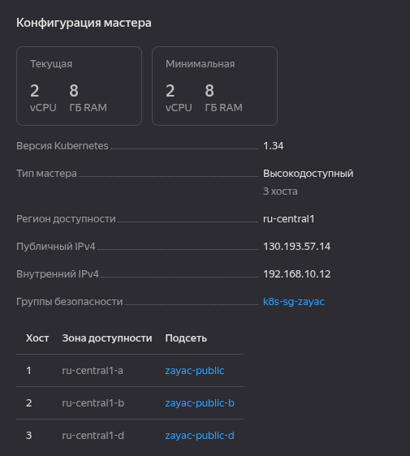
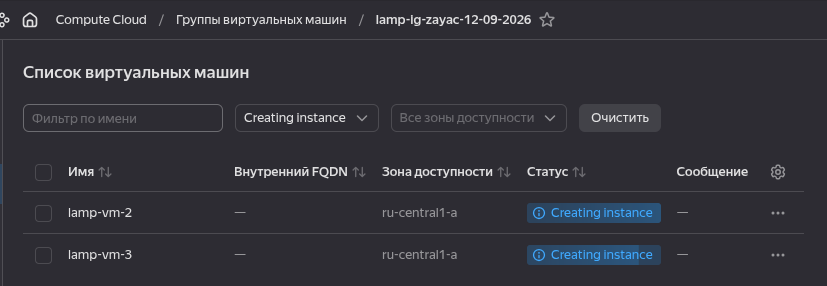
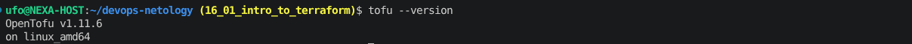

# Домашнее задание к занятию 1 «Введение в Terraform» - `Заяц Алексей`

### Цели задания

1. Установить и настроить Terrafrom.
2. Научиться использовать готовый код.

------

### Чек-лист готовности к домашнему заданию

1. Скачайте и установите **Terraform** версии >=1.12.0 . Приложите скриншот вывода команды ```terraform --version```.
2. Скачайте на свой ПК этот git-репозиторий. Исходный код для выполнения задания расположен в директории **01/src**.
3. Убедитесь, что в вашей ОС установлен docker.

### Решение:


------

### Инструменты и дополнительные материалы, которые пригодятся для выполнения задания

1. Репозиторий с ссылкой на зеркало для установки и настройки Terraform: [ссылка](https://github.com/netology-code/devops-materials).
2. Установка docker: [ссылка](https://docs.docker.com/engine/install/ubuntu/). 
------
### Внимание!! Обязательно предоставляем на проверку получившийся код в виде ссылки на ваш github-репозиторий!
------

### Задание 1

1. Перейдите в каталог [**src**](https://github.com/netology-code/ter-homeworks/tree/main/01/src). Скачайте все необходимые зависимости, использованные в проекте. 
2. Изучите файл **.gitignore**. В каком terraform-файле, согласно этому .gitignore, допустимо сохранить личную, секретную информацию?(логины,пароли,ключи,токены итд)
3. Выполните код проекта. Найдите  в state-файле секретное содержимое созданного ресурса **random_password**, пришлите в качестве ответа конкретный ключ и его значение.
4. Раскомментируйте блок кода, примерно расположенный на строчках 29–42 файла **main.tf**.
Выполните команду ```terraform validate```. Объясните, в чём заключаются намеренно допущенные ошибки. Исправьте их.
5. Выполните код. В качестве ответа приложите: исправленный фрагмент кода и вывод команды ```docker ps```.
6. Замените имя docker-контейнера в блоке кода на ```hello_world```. Не перепутайте имя контейнера и имя образа. Мы всё ещё продолжаем использовать name = "nginx:latest". Выполните команду ```terraform apply -auto-approve```.
Объясните своими словами, в чём может быть опасность применения ключа  ```-auto-approve```. Догадайтесь или нагуглите зачем может пригодиться данный ключ? В качестве ответа дополнительно приложите вывод команды ```docker ps```.
8. Уничтожьте созданные ресурсы с помощью **terraform**. Убедитесь, что все ресурсы удалены. Приложите содержимое файла **terraform.tfstate**. 
9. Объясните, почему при этом не был удалён docker-образ **nginx:latest**. Ответ **ОБЯЗАТЕЛЬНО НАЙДИТЕ В ПРЕДОСТАВЛЕННОМ КОДЕ**, а затем **ОБЯЗАТЕЛЬНО ПОДКРЕПИТЕ** строчкой из документации [**terraform провайдера docker**](https://library.tf/providers/kreuzwerker/docker/latest).  (ищите в классификаторе resource docker_image )

### Решение:

2. Секретную информацию допустимо сохранять в файле **personal.auto.tfvars** #хранилище секретных переменных
3. Поле **"result": "wMHJn9qhUPtqlCFH"**


4. На строке первой у ресурса указан только тип, отсутсвует имя. На второй строке имена ресурсов не могут содержать цифру. В третьей строке обращение к несуществующему ресурсу.
5. Исправленный блок кода:

```bash
resource "docker_image" "nginx" {
  name         = "nginx:latest"
  keep_locally = true
}

resource "docker_container" "nginx" {
  image = docker_image.nginx.image_id
  name  = "example_${random_password.random_string.result}"

  ports {
    internal = 80
    external = 9090
```


6. Ключ **-auto-approve** автоматически подтверждает применение плана запроса на подтверждение.


**Зачем может пригодиться -auto-approve?**

**Автоматизация** – в пайплайнах CI/CD (GitHub Actions, GitLab CI, Jenkins), где подтверждение не требуется, так как план уже проверен на предыдущих этапах (например, terraform plan отдельно).

**Скрипты и тесты** – при написании автоматических тестов или одноразовых окружений, где скорость важнее ручного контроля.

**Локальная разработка** – для быстрого развёртывания известных и безопасных изменений на тестовых стендах.

7. Содержимое после уничтожения:



8. Образ nginx:latest не был удалён при выполнении terraform destroy из-за явного указания параметра keep_locally = true в блоке ресурса docker_image. Этот параметр прямо в коде предписывает Terraform не удалять образ из локального хранилища Docker.

```bash
keep_locally = true
```

Из документации:
keep_locally (Boolean) - If true, then the Docker image won't be deleted on destroy operation. If this is false, it will delete the image from the docker local storage on destroy operation.

------

### Задание 2*

1. Создайте в облаке ВМ. Сделайте это через web-консоль, чтобы не слить по незнанию токен от облака в github(это тема следующей лекции). Если хотите - попробуйте сделать это через terraform, прочитав документацию yandex cloud. Используйте файл ```personal.auto.tfvars``` и гитигнор или иной, безопасный способ передачи токена!
2. Подключитесь к ВМ по ssh и установите стек docker.
3. Найдите в документации docker provider способ настроить подключение terraform на вашей рабочей станции к remote docker context вашей ВМ через ssh.
4. Используя terraform и  remote docker context, скачайте и запустите на вашей ВМ контейнер ```mysql:8``` на порту ```127.0.0.1:3306```, передайте ENV-переменные. Сгенерируйте разные пароли через random_password и передайте их в контейнер, используя интерполяцию из примера с nginx.(```name  = "example_${random_password.random_string.result}"```  , двойные кавычки и фигурные скобки обязательны!) 
```
    environment:
      - "MYSQL_ROOT_PASSWORD=${...}"
      - MYSQL_DATABASE=wordpress
      - MYSQL_USER=wordpress
      - "MYSQL_PASSWORD=${...}"
      - MYSQL_ROOT_HOST="%"
```

6. Зайдите на вашу ВМ , подключитесь к контейнеру и проверьте наличие секретных env-переменных с помощью команды ```env```. Запишите ваш финальный код в репозиторий.

### Решение:

1. Заходим в каталог [infra](infra/), в котором выполняем код для поднятия машины:

```bash
cd infra
terraform init
terraform apply
```

2. Затем заходим в каталог [docker](infra/docker/), в котором  выполняем код для поднятия докер:

```bash
cd docker
terraform init
terraform apply
```

3. Подключаемся к машине из корня проекта командой:
```bash
ssh -i secrets/cloud-zayac-04-2026 -l localadmin <IP-публичный-VM>
```

4. Выполняем проверку на ВМ:

```bash
docker exec -it tf-mysql-zayac-04-2026 env | grep MYSQL
```



------

### Задание 3*
1. Установите [opentofu](https://opentofu.org/)(fork terraform с лицензией Mozilla Public License, version 2.0) любой версии
2. Попробуйте выполнить тот же код с помощью ```tofu apply```, а не terraform apply.

### Решение:

```bash
cd infra/
tofu init
tofu apply

cd docker 
tofu init
tofu apply
```

