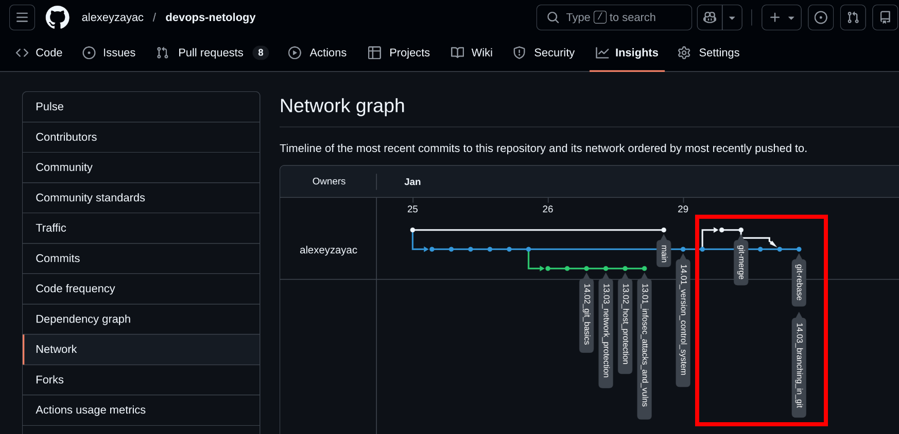

# Домашнее задание к занятию 3 «Ветвления в Git» - `Заяц Алексей`

### Цель задания

В процессе работы над заданием вы потренеруетесь делать merge и rebase. В результате вы поймете разницу между ними и научитесь решать конфликты.   

Обычно при нормальном ходе разработки выполнять `rebase` достаточно просто. 
Это позволяет объединить множество промежуточных коммитов при решении задачи, чтобы не засорять историю. Поэтому многие команды и разработчики предпочитают такой способ.   


### Инструкция к заданию

1. В личном кабинете отправьте на проверку ссылку на network графика вашего репозитория.
2. Любые вопросы по решению задач задавайте в разделе "Вопросы по заданию".


### Дополнительные материалы для выполнения задания

1. Тренажёр [LearnGitBranching](https://learngitbranching.js.org/), где можно потренироваться в работе с деревом коммитов и ветвлений. 

------

## Задание «Ветвление, merge и rebase»  

**В выполнение задания ветка 14.03_branching_in_git = main**

## Подготовка файла merge.sh

### Шаг 1.


### Шаг 5. 


## Изменим main

### Шаг 3.


## Подготовка файла rebase.sh

### Шаг 2. + Шаг 3. + Шаг 4. + Шаг 5.   

```bash
ufo@NEXA-HOST:~/devops-netology (14.03_branching_in_git)$ git log --oneline -2
2f1f406 (HEAD -> 14.03_branching_in_git, origin/14.03_branching_in_git) main: update rebase.sh
4c1006c prepare for merge and rebase
ufo@NEXA-HOST:~/devops-netology (14.03_branching_in_git)$ git checkout 4c1006c
ufo@NEXA-HOST:~/devops-netology ((HEAD отделён на 4c1006c))$ git switch -c git-rebase
Переключились на новую ветку «git-rebase»
ufo@NEXA-HOST:~/devops-netology (git-rebase)$ git commit -am "git-rebase 1"
ufo@NEXA-HOST:~/devops-netology (git-rebase)$ git commit -am "git-rebase 2"
```

## Промежуточный итог


## Merge


## Rebase

### Шаг 6. 


### Шаг 7. + Шаг 8. 


### Шаг 9. + Итог

```bash
ufo@NEXA-HOST:~/devops-netology (git-rebase)$ git checkout 14.03_branching_in_git
Переключились на ветку «14.03_branching_in_git»
Эта ветка соответствует «origin/14.03_branching_in_git».
ufo@NEXA-HOST:~/devops-netology (14.03_branching_in_git)$ git merge git-rebase
Обновление a85e66e..f00ab36
Fast-forward
 branching/rebase.sh | 6 ++----
 1 file changed, 2 insertions(+), 4 deletions(-)
```


**[Network graph](https://github.com/alexeyzayac/devops-netology/network)**

Ветление до последнего комита, с целью размежения ДЗ.

