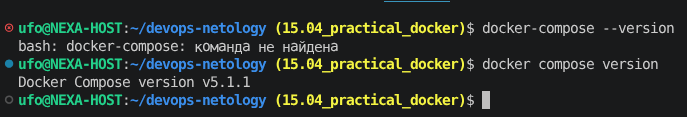
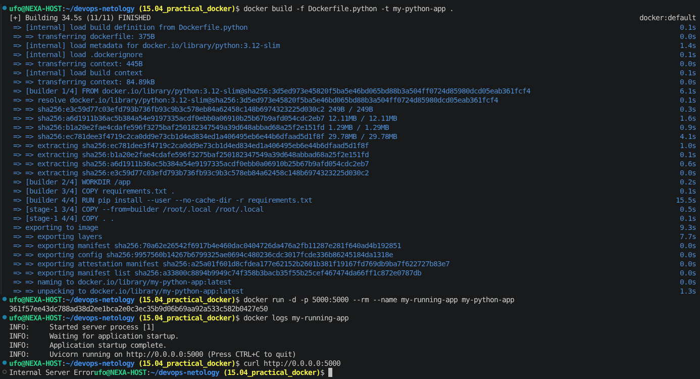

# Домашнее задание к занятию 5 «Практическое применение Docker» - `Заяц Алексей`

### Инструкция к выполнению

1. Для выполнения заданий обязательно ознакомьтесь с [инструкцией](https://github.com/netology-code/devops-materials/blob/master/cloudwork.MD) по экономии облачных ресурсов. Это нужно, чтобы не расходовать средства, полученные в результате использования промокода.
3. **Своё решение к задачам оформите в вашем GitHub репозитории.**
4. В личном кабинете отправьте на проверку ссылку на .md-файл в вашем репозитории.
5. Сопроводите ответ необходимыми скриншотами.

---
## Примечание: Ознакомьтесь со схемой виртуального стенда [по ссылке](https://github.com/netology-code/shvirtd-example-python/blob/main/schema.pdf)

---

## Задача 0
1. Убедитесь что у вас НЕ(!) установлен ```docker-compose```, для этого получите следующую ошибку от команды ```docker-compose --version```
```
Command 'docker-compose' not found, but can be installed with:

sudo snap install docker          # version 24.0.5, or
sudo apt  install docker-compose  # version 1.25.0-1

See 'snap info docker' for additional versions.
```
В случае наличия установленного в системе ```docker-compose``` - удалите его.  
2. Убедитесь что у вас УСТАНОВЛЕН ```docker compose```(без тире) версии не менее v2.24.X, для это выполните команду ```docker compose version```  
###  **Своё решение к задачам оформите в вашем GitHub репозитории!!!!!!!!!!!!!!!!!!!!!!!!!!!!!!!!**

### Решение: 



---

## Задача 1
1. Сделайте в своем GitHub пространстве fork [репозитория](https://github.com/netology-code/shvirtd-example-python).

2. Создайте файл ```Dockerfile.python``` на основе существующего `Dockerfile`:
   - Используйте базовый образ ```python:3.12-slim```
   - Обязательно используйте конструкцию ```COPY . .``` в Dockerfile
   - Создайте `.dockerignore` файл для исключения ненужных файлов
   - Используйте ```CMD ["uvicorn", "main:app", "--host", "0.0.0.0", "--port", "5000"]``` для запуска
   - Протестируйте корректность сборки
2.1 Используйте multistage сборку вместо single stage.
3. (Необязательная часть, *) Изучите инструкцию в проекте и запустите web-приложение без использования docker, с помощью venv. (Mysql БД можно запустить в docker run).
4. (Необязательная часть, *) Изучите код приложения и добавьте управление названием таблицы через ENV переменную.
---
### ВНИМАНИЕ!
!!! В процессе последующего выполнения ДЗ НЕ изменяйте содержимое файлов в fork-репозитории! Ваша задача ДОБАВИТЬ 5 файлов: ```Dockerfile.python```, ```compose.yaml```, ```.gitignore```, ```.dockerignore```,```bash-скрипт```. Если вам понадобилось внести иные изменения в проект - вы что-то делаете неверно!
---

### Решение: 

**[multistage](Dockerfile.python)**



---